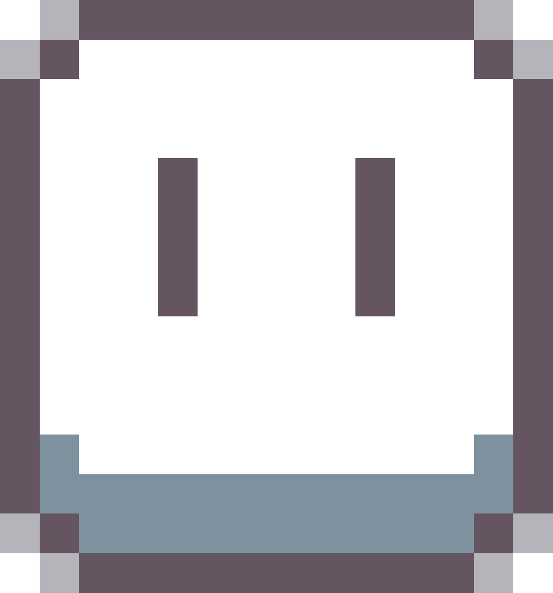
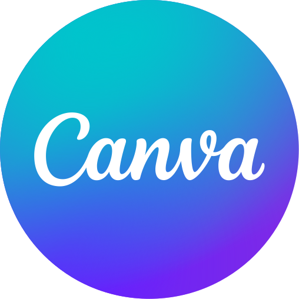
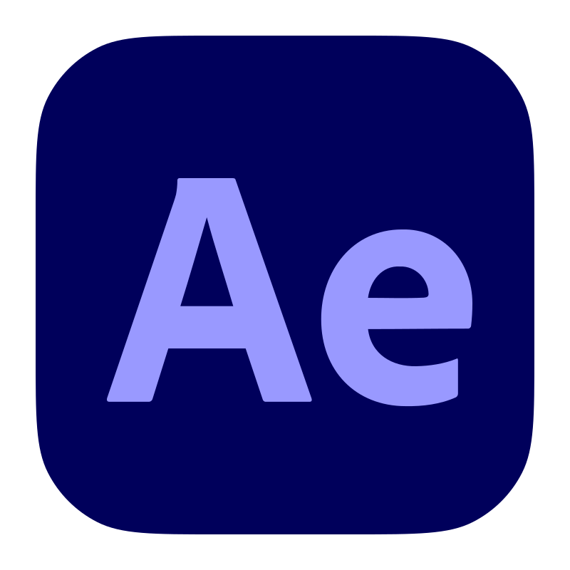
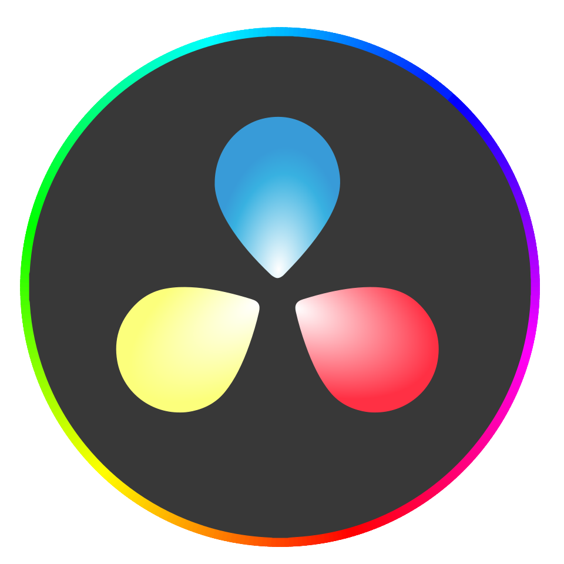

<!-- ========================================= -->
<!--                HEADER                     -->
<!-- ========================================= -->

<p align="center">
  
</p>

<h1 align="center">
Hi 👋 I'm Deepak
</h1>

<p align="center">
<b>Software Developer • Game Developer • Frontend Enthusiast • Creative Technologist</b>
</p>

<p align="center">


</p>

---

<p align="center">


</p>

---

<p align="center">

<a href="mailto:deepakgnanavel21@gmail.com">

</a>

<a href="https://github.com/Deepak-Desanta">

</a>

<a href="https://www.linkedin.com/in/deepak-g-787aa9330">

</a>

</p>

---

<p align="center">


</p>

---

# About Me

I'm a **Final Year Engineering Student** passionate about building software that combines functionality, creativity, and excellent user experience.

My interests span **Software Development**, **Frontend Engineering**, **UI/UX Design**, and **2D Game Development**, where I enjoy transforming ideas into interactive digital products.

I believe good software is not only technically sound but also intuitive, scalable, and enjoyable to use. Every project I build is an opportunity to improve my engineering mindset while learning modern technologies and development practices.

As an aspiring engineer, I continuously expand my skills through personal projects, design exploration, and experimentation with new tools and frameworks.

---

## What I'm Currently Focused On

- Building responsive frontend applications
- Learning advanced JavaScript concepts
- Developing 2D games using Godot Engine
- Improving UI/UX design workflow using Figma
- Strengthening software engineering fundamentals
- Preparing for internships and real-world product development

---

## Open To

✔ Software Engineering Internship

✔ Frontend Development Internship

✔ Game Development Internship

✔ Freelance Opportunities

✔ Open Source Collaboration

✔ Research Projects

---

# Tech Stack

## Programming Languages

<p>


</p>

---

## Frontend

<p>


</p>

---

## Game Development

<p>

&nbsp;&nbsp;
&nbsp;&nbsp;

</p>

| Tool | Purpose |
|------|---------|
| Godot Engine | 2D Game Development |
| Aseprite | Pixel Art & Sprite Animation |

---

## Design & Creative Tools

<p>

&nbsp;&nbsp;
&nbsp;&nbsp;
&nbsp;&nbsp;
&nbsp;&nbsp;
&nbsp;&nbsp;

</p>

| Tool | Purpose |
|------|---------|
| Figma |  UI/UX Design Prototyping |
| Canva | Graphic Design |
| After Effects | Motion Graphics, Visual Effects (VFX), Compositing | 
| CapCut | Content Editing |
| DaVinci Resolve | Video Editing, Color Grading|


---

## Currently Learning

- Responsive Web Design
- Modern Frontend Development
- Game Programming
- Software Engineering Principles
- UI/UX Design Systems

---

# AI & Future Technology Interests

Although I am currently focused on software engineering and frontend development, I have a strong interest in expanding into Artificial Intelligence and modern game technologies in the future.

| Domain | Current Level | Roadmap |
|---------|--------------|----------|
| Artificial Intelligence | Beginner | Learn ML Fundamentals |
| Machine Learning | Beginner | Build Practical Projects |
| Computer Vision | Beginner | Future Exploration |
| Game AI | Beginner | NPC & Pathfinding Systems |
| Data Structures & Algorithms | Intermediate | Interview Preparation |
| Software Engineering | Intermediate | Scalable Product Development |

---

## Engineering Philosophy

> *"Great software is built by continuously learning, experimenting, and refining ideas into products that create real value."*

---

## Beyond Coding

- UI Design
- Video Editing
- Motion Graphics
- 2D Game Development
- Creative Problem Solving
- Continuous Learning

---
---

# Featured Projects

<details open>
<summary><b>🎮 2D Platformer Game (Godot)</b></summary>

<br>

A work-in-progress 2D platformer built with the Godot Engine. This project focuses on smooth movement, engaging gameplay mechanics, reusable level design, and clean game architecture while strengthening my game development skills.

| Category | Details |
|----------|---------|
| **Engine** | Godot Engine |
| **Language** | GDScript |
| **Genre** | 2D Platformer |
| **Status** | 🚧 In Development |
| **Performance** | Optimized for smooth gameplay |
| **Security** | Local project with modular architecture |
| **Impact** | Learning game architecture, animation systems, physics, and player mechanics |
| **Repository** | *Coming Soon* |

### Highlights

- Character movement & jumping
- Collision detection
- Sprite animation
- TileMap level creation
- Collectible items
- Future enemy AI
- Modular scene architecture

**Goal**

Build a polished 2D platformer while learning professional game development workflows and scalable project organization.

</details>

---

<details>
<summary><b>🌐 Personal Portfolio Website</b></summary>

<br>

A responsive personal website showcasing my projects, technical skills, and development journey while practicing modern frontend development principles.

| Category | Details |
|----------|---------|
| **Frontend** | HTML, CSS |
| **Backend** | Planned |
| **Status** | 🚧 Improving |
| **Performance** | Lightweight static website |
| **Responsive** | Mobile Friendly |
| **Impact** | Personal branding and frontend practice |
| **Repository** | *Coming Soon* |

### Features

- Responsive layout
- Clean UI
- About section
- Skills showcase
- Contact section
- Future project gallery
- Dark theme

**Goal**

Create a professional portfolio that represents my growth as a software and game developer.

</details>

---

<details>
<summary><b>🏓 Pong Game</b></summary>

<br>

A classic two-player Pong game built using Python. Developed to strengthen programming fundamentals including game loops, collision detection, score management, and event handling.

| Category | Details |
|----------|---------|
| **Language** | Python |
| **Library** | Pygame |
| **Players** | Two Player Local |
| **Performance** | Smooth gameplay |
| **Security** | Local application |
| **Impact** | Strengthened game programming fundamentals |
| **Repository** | https://github.com/Deepak-Desanta/Pong-game |

### Features

- Local multiplayer
- Keyboard controls
- Score system
- Ball collision physics
- Paddle movement
- Restart functionality

**What I Learned**

- Object-oriented programming
- Game loops
- Collision detection
- Event handling
- Rendering techniques

</details>

---

<details>
<summary><b>🎨 UI/UX Design Projects</b></summary>

<br>

A collection of interface designs and prototypes created using Figma. These projects focus on clean layouts, usability, typography, color systems, and responsive design principles.

| Category | Details |
|----------|---------|
| **Tool** | Figma |
| **Type** | UI/UX Design |
| **Status** | Active |
| **Design Focus** | User Experience |
| **Impact** | Improved design thinking and prototyping skills |
| **Repository** | Private / Coming Soon |

### Design Areas

- Mobile UI
- Landing Pages
- Dashboard Design
- Components
- Auto Layout
- Interactive Prototypes

</details>

---

<details>
<summary><b>🎬 Motion Graphics & Video Editing</b></summary>

<br>

Creative editing projects produced using Adobe After Effects and DaVinci Resolve, focusing on cinematic editing, motion graphics, transitions, and visual storytelling.

| Category | Details |
|----------|---------|
| **Software** | After Effects, DaVinci Resolve |
| **Category** | Motion Graphics |
| **Status** | Ongoing |
| **Specialization** | Motion Design & Editing |
| **Impact** | Enhanced visual communication and storytelling |

### Skills Applied

- Motion Graphics
- Keyframe Animation
- Typography Animation
- Video Editing
- Color Correction
- Visual Effects

</details>

---

## Project Roadmap

| Quarter | Focus |
|----------|-------|
| Q3 2026 | Build polished frontend projects |
| Q4 2026 | Complete multiple Godot games |
| Q1 2027 | Learn JavaScript deeply |
| Q2 2027 | Build full-stack applications |
| Future | Learn Unity & Unreal Engine |

---

## Development Principles

✔ Clean Code

✔ Reusable Components

✔ Continuous Learning

✔ User-Centered Design

✔ Performance First

✔ Creative Problem Solving

✔ Consistent Improvement

---
---

# Experience

## Engineering Journey

| Role | Organization | Duration | Status |
|------|--------------|----------|--------|
| **Software & Game Developer (Self-Learning)** | Personal Projects | 2024 – Present | Active |
| **Frontend Developer (Learning)** | Personal Portfolio | 2025 – Present | Active |
| **UI/UX Designer** | Personal Design Projects | 2024 – Present | Active |

### Software & Game Developer

**Personal Projects**  
**2024 – Present**

Developing software and games through self-driven learning while continuously improving programming, problem-solving, and software engineering skills.

**Scope of Work**

- Building responsive web pages
- Developing 2D games using Godot Engine
- Learning software architecture
- Practicing clean code principles
- Creating UI/UX prototypes
- Improving debugging skills
- Version control using Git & GitHub

**Skills**

`HTML`
`CSS`
`Python`
`C++`
`Godot`
`GitHub`
`Figma`

---

# Leadership & Activities

### Student Coordinator — Zenith '26 National Symposium

Served as a **Student Coordinator** for **Zenith '26**, contributing to event planning, communication, team coordination, and execution.

### Responsibilities

- Coordinated with multiple student teams
- Assisted in event management
- Managed communication between departments
- Helped organize technical sessions
- Improved leadership and teamwork skills

---

# Achievements

<div align="center">

| Recognition | Details |
|-------------|---------|
| 🏆 Student Coordinator | Zenith '26 National Symposium |
| 🎨 UI/UX Competition | Build in 60 Minutes |
| 🚀 Self-Learning Journey | Software Development |
| 🎮 Personal Projects | Frontend & Game Development |

</div>

---

# Certifications

## Infosys Springboard


---

## Artificial Intelligence


Issued by **Infotech Company (ISO Verified)**

---

## Workshops


**Chennai Institute of Technology**

<br>


**Make Labs R&D**

---

## UI / UX


---

# Professional Skills

<table>

<tr>

<td>

### Engineering

- Problem Solving
- Critical Thinking
- Software Design
- Debugging
- Continuous Learning

</td>

<td>

### Collaboration

- Teamwork
- Communication
- Leadership
- Adaptability
- Time Management

</td>

</tr>

</table>

---

# Technical Skills

| Category | Technologies |
|-----------|--------------|
| Programming | Python, C++ |
| Frontend | HTML, CSS |
| Game Development | Godot, 2D Games |
| UI/UX | Figma, Canva |
| Video Editing | After Effects, DaVinci Resolve, CapCut |
| Version Control | Git, GitHub |

---

# Coding Profiles

<p align="center">

<a href="https://leetcode.com/">

</a>

<a href="https://www.geeksforgeeks.org/">

</a>

<a href="https://www.hackerrank.com/">

</a>

<a href="https://www.codechef.com/">

</a>

</p>

---

# Engineering Mindset

> **"Every project is an opportunity to learn something new, improve my skills, and build software that creates meaningful experiences."**

---
---

# GitHub Analytics

<p align="center">


</p>

<p align="center">


</p>

---

# GitHub Trophies

<p align="center">


</p>

---

# Contribution Activity

<p align="center">


</p>

---

# Contribution Snake

<p align="center">


</p>

> **Note:** The snake animation will appear after enabling the GitHub Action that generates it.

---

# Current Focus

```yaml
learning:
  - Advanced HTML & CSS
  - JavaScript
  - Responsive Web Design
  - Software Engineering
  - Godot Engine
  - Unity (Future)
  - Unreal Engine (Future)

building:
  - Personal Portfolio Website
  - 2D Platformer Game
  - Frontend Projects
  - Small Indie Games

exploring:
  - Game Architecture
  - Clean Code Practices
  - UI/UX Design Systems
  - New Development Tools

open_to:
  - Software Engineering Internship
  - Frontend Development
  - Game Development
  - Freelance Projects
  - Open Source Contributions
```

---

# Connect With Me

<p align="center">

<a href="mailto:deepakgnanavel21@gmail.com">


</a>

<a href="https://github.com/Deepak-Desanta">


</a>

<a href="https://www.linkedin.com/in/deepak-g-787aa9330">


</a>

</p>

---

# Visitor Counter

<p align="center">


</p>

---

# Quote

<p align="center">

> **"Building software is not just about writing code—it's about solving problems, creating experiences, and continuously improving."**

</p>

---

<p align="center">


</p>
